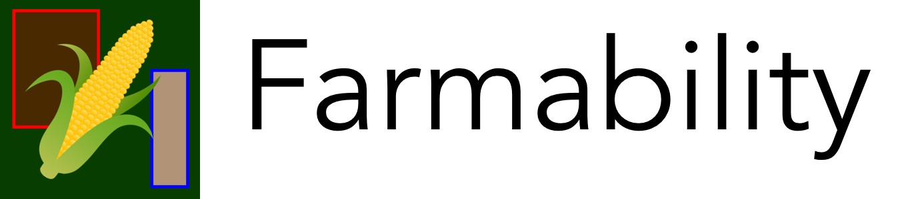
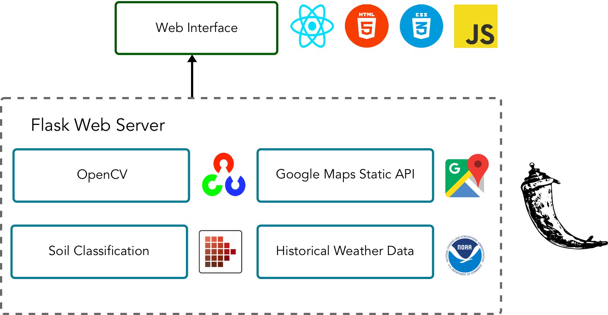
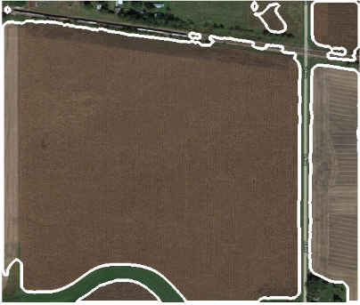
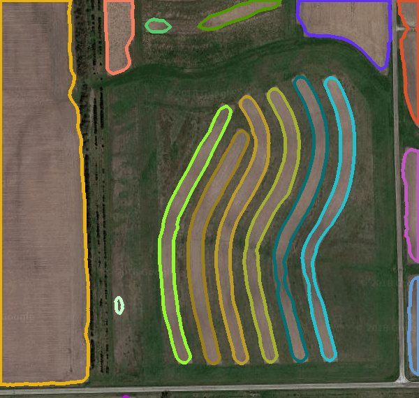

## Description
`Farmability` is a web accessible tool that automates the process of outlining the tillable area on a plot of farmland. 

Won [Challenge #2 and 3rd Place Overall](https://devpost.com/software/farmability) at [AGCO Accelerator Hackathon 2019](https://agco-accelerator-hack.com/).

## Prompt
CHALLENGE #2: WHERE DO I FARM?

It may surprise you to know that farmer’s don’t always know where to farm. They have 2D and 3D maps of their land provided by the government and through apps like Google Maps, but not all of the land can be farmed because of things like buildings, streams, ditches, roads, electrical lines, etc.

This challenge is to create a software tool using readily available maps as input to create a series map defining the usable area to be covered by an agricultural operation.

The vision is that that farmers can use this map to plan and execute their farming operations throughout the crop cycle or to create a coverage path at the field entrance just before starting to operate. The coverage map needs to clearly identify ‘no-farm zone’ assets as zones excluded from the rest of the field.

## Features
`Farmability` provides the following data:
- Plantable Area
- Average Historical Precipitation for the Area
- Soil Characteristics for the Tillable Land using Soil Color and Munsell Soil Classification

## Architecture

## Processed Image Examples

  
  

## Resources
https://patents.google.com/patent/US20160029545?oq=field+characteristics+satellite+image

https://agco-accelerator-hack.com/challenge-2.pdf

http://ecocrop.fao.org/ecocrop/srv/en/cropSearchForm

